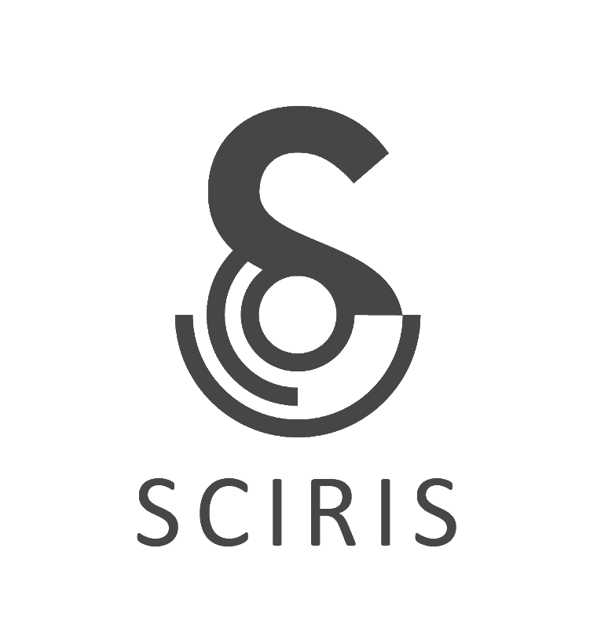

.. title:: Sciris

Sciris: Simplifying Scientific Python
=====================================

.. include:: ../README.rst
   :start-line: 15

Learn more
----------

.. grid:: 2
    :gutter: 4

    .. grid-item-card:: Getting started
        :link: https://example.com

        Find out more detail about the Sciris project, see some use cases, and learn about the most important features.

    .. grid-item-card:: Tutorials
        :link: https://example.com

        An interactive tour of Sciris' key features, including containers, parallelization, file loading and saving, and more.

    .. grid-item-card:: API reference
        :link: https://example.com

        All the gory detail of every function and class.

    .. grid-item-card:: What's new
        :link: https://example.com
        
        See what's hot off the press.

.. toctree::
   :maxdepth: 1
   :hidden:

   overview
   whatsnew
   contributing
   code_of_conduct
   style_guide
   api/index  
