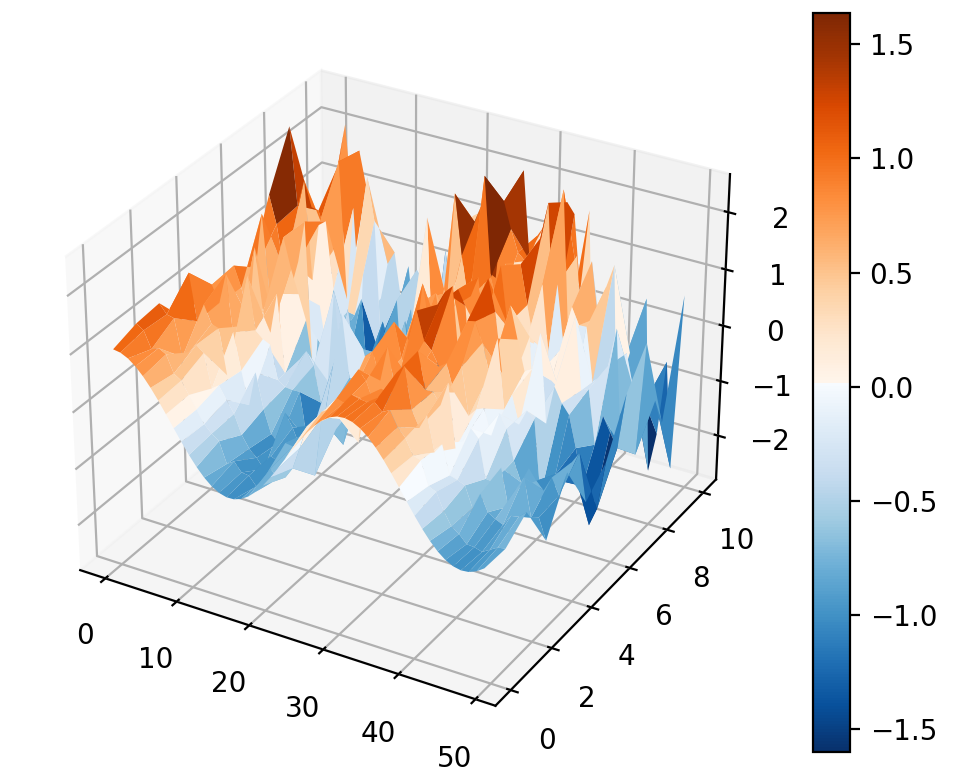
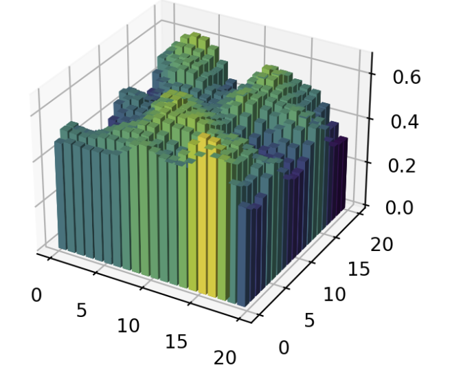
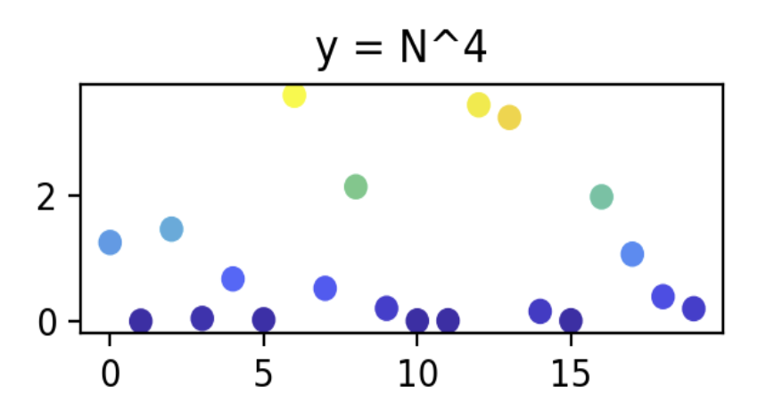
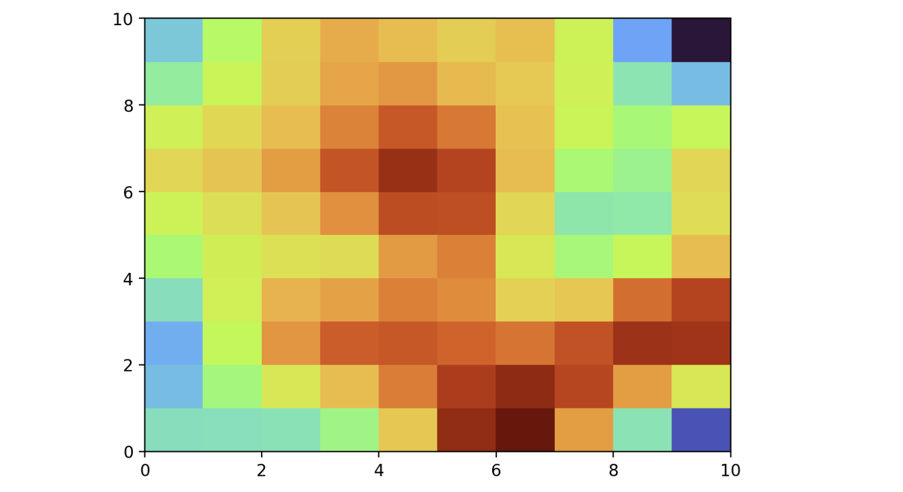
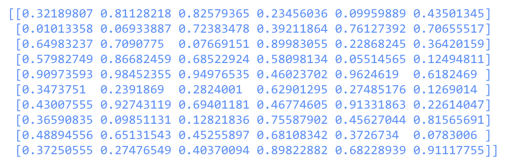
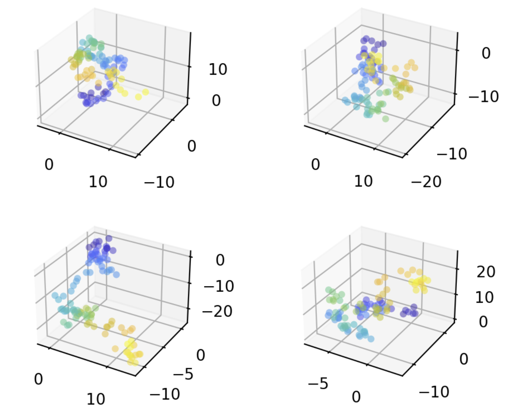
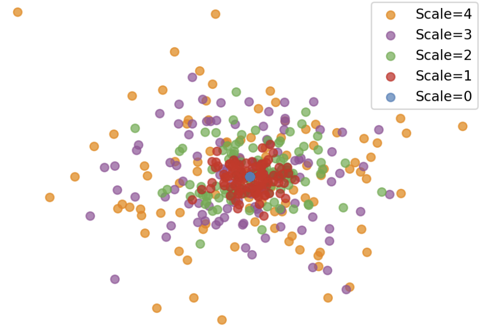
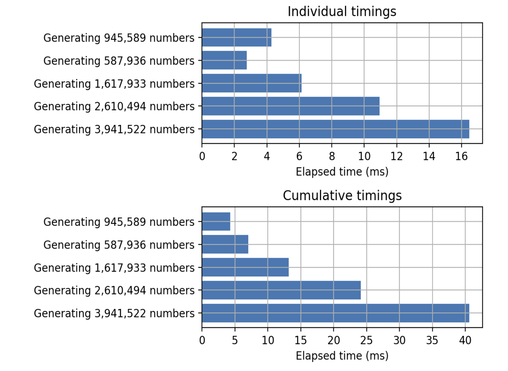
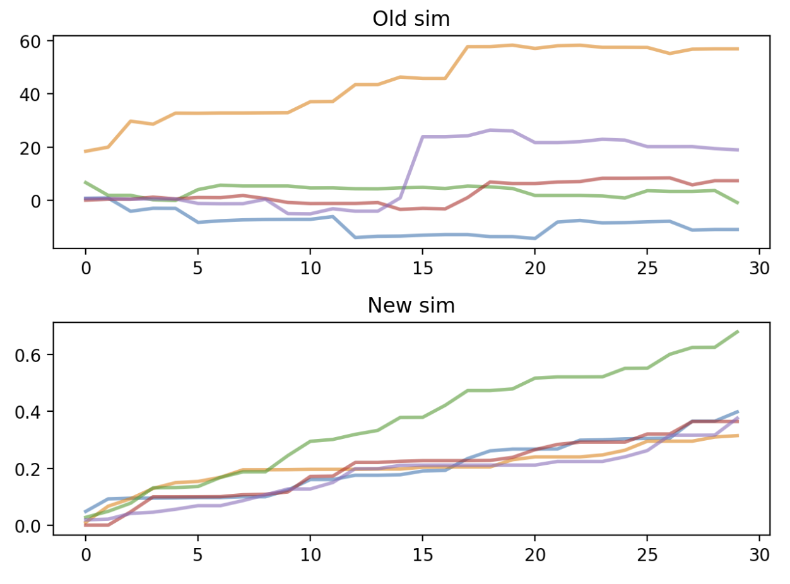
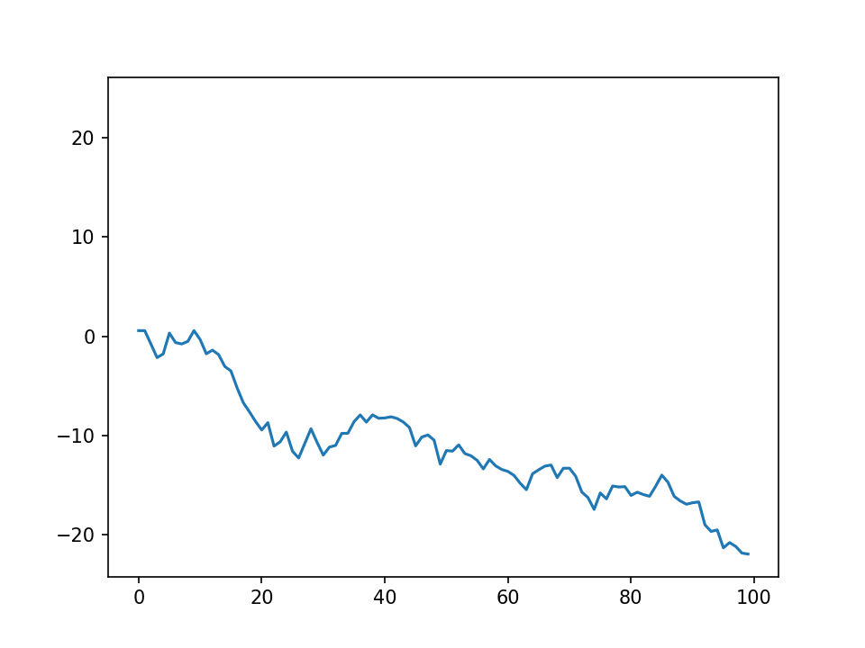

# Tutorials

These tutorials illustrate the main features of Sciris. They roughly make the most sense in the order listed, but can be done in any order. Each one should take about 5 minutes to skim through, or 20-30 minutes to go through in detail.

These tutorials assume you are already familiar with [NumPy](https://numpy.org/doc/stable/user/index.html), [Matplotlib](https://matplotlib.org/stable/index.html), and (recommended but not essential) [pandas](https://pandas.pydata.org/docs/). If you aren't, you'll be much happier if you learn those first, since Sciris builds off them.

Questions? Did you complete all the tutorials and want to claim your free "I Am A Scirientist" t-shirt?† Reach out to us at [info@sciris.org](mailto:info@sciris.org).

:::::: {.grid}

::::: {.g-col-12 .g-col-md-6}

:::: {.card .h-100}

[{.card-img-top}](tutorials/tut_intro.qmd)

::: {.card-body}

#### [1. Whirlwind tour](tutorials/tut_intro.qmd)
A quick high-level overview of all of Sciris' most important features.

:::

::::

:::::

::::: {.g-col-12 .g-col-md-6}

:::: {.card .h-100}

[{.card-img-top}](tutorials/tut_arrays.qmd)

::: {.card-body}

#### [2. Array tools](tutorials/tut_arrays.qmd)
Arrays are at the core of scientific computing, and this tutorial will go through some tools that will make it easier to work with them.

:::

::::

:::::

::::: {.g-col-12 .g-col-md-6}

:::: {.card .h-100}

[{.card-img-top}](tutorials/tut_dicts.qmd)

::: {.card-body}

#### [3. Dictionaries and dataframes](tutorials/tut_dicts.qmd)
Data are only as good as the container they're stored in, so this tutorial goes through Sciris' two main containers (ordered dictionaries and dataframes).

:::

::::

:::::

::::: {.g-col-12 .g-col-md-6}

:::: {.card .h-100}

[{.card-img-top}](tutorials/tut_files.qmd)

::: {.card-body}

#### [4. Files and versioning](tutorials/tut_files.qmd)
All that data has to come from and go somewhere: this tutorial covers saving and loading files, including with version metadata.

:::

::::

:::::

::::: {.g-col-12 .g-col-md-6}

:::: {.card .h-100}

[{.card-img-top}](tutorials/tut_printing.qmd)

::: {.card-body}

#### [5. Printing](tutorials/tut_printing.qmd)
This tutorial covers tools for quickly printing out information about objects and data. (As you can see, you won't have an opportunity to make any cool plots in this tutorial, but it's worth doing anyway, promise!)

:::

::::

:::::

::::: {.g-col-12 .g-col-md-6}

:::: {.card .h-100}

[{.card-img-top}](tutorials/tut_plotting.qmd)

::: {.card-body}

#### [6. Plotting](tutorials/tut_plotting.qmd)
If you don't plot it, did it even happen? This tutorial covers Sciris' plotting tools and shortcuts that extend [Matplotlib](https://matplotlib.org/stable/index.html).

:::

::::

:::::

::::: {.g-col-12 .g-col-md-6}

:::: {.card .h-100}

[{.card-img-top}](tutorials/tut_parallel.qmd)

::: {.card-body}

#### [7. Parallelization and profiling](tutorials/tut_parallel.qmd)
When you need answers faster: this tutorial covers running your code in parallel, as well as how to profile it to help find performance improvements.

:::

::::

:::::

::::: {.g-col-12 .g-col-md-6}

:::: {.card .h-100}

[{.card-img-top}](tutorials/tut_dates.qmd)

::: {.card-body}

#### [8. Dates and times](tutorials/tut_dates.qmd)
Compared to nice simple numbers that behave in nice simple ways, dates can be a pain to work with. This tutorial goes through some ways to manipulate them more easily, as well as how to time parts of your code.

:::

::::

:::::

::::: {.g-col-12 .g-col-md-6}

:::: {.card .h-100}

[{.card-img-top}](tutorials/tut_utils.qmd)

::: {.card-body}

#### [9. Miscellaneous utilities](tutorials/tut_utils.qmd)
Sometimes (probably often), you just need to do some random tedious task. Is there a shortcut for it in Sciris? Find out here.

:::

::::

:::::

::::: {.g-col-12 .g-col-md-6}

:::: {.card .h-100}

[{.card-img-top}](tutorials/tut_advanced.qmd)

::: {.card-body}

#### [10. Advanced features](tutorials/tut_advanced.qmd)
You probably won't often need these tools, but we think they're cool, and they're here waiting for you just in case.

:::

::::

:::::

::::::

::: {.callout-tip}

## Running the tutorials locally

The tutorials are Quarto documents, which can be run directly in Jupyter (as long as `jupytext` is installed), in [VS Code](https://marketplace.visualstudio.com/items?itemName=quarto.quarto), or in [Positron](https://posit.co/products/ide/positron/). To run them:

1. Clone the [Sciris repository](https://github.com/sciris/sciris)
2. Install Sciris and the docs requirements: `pip install -e . && pip install -r docs/requirements.txt`
3. Navigate to the `docs/tutorials` folder
4. Optionally convert them to Jupyter notebooks: `./convert_notebooks`
5. Launch Jupyter: `jupyter lab`

:::

† There is no free t-shirt, sorry. But you made it to the end, yay!
