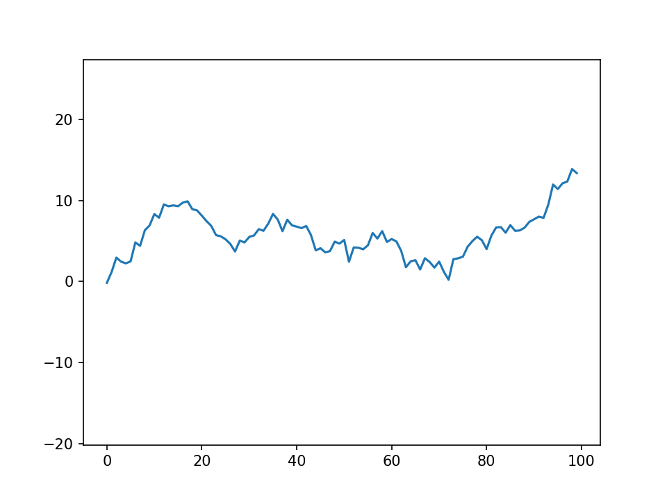

Here are yet more tools that the average user won't need, but might come in handy one day.

## Nested dictionaries

Nested dictionaries are a useful way of storing complex data (and in fact are more or less the basis of JSON), but can be a pain to interact with if you don't know the structure in advance. Sciris has several functions for working with nested dictionaries. For example:

```{python}
import sciris as sc

# Create the structure
nest = {}
sc.makenested(nest, ['key1','key1.1'])
sc.makenested(nest, ['key1','key1.2'])
sc.makenested(nest, ['key1','key1.3'])
sc.makenested(nest, ['key2','key2.1','key2.1.1'])
sc.makenested(nest, ['key2','key2.2','key2.2.1'])

# Set the value for each "twig"
count = 0
for twig in sc.iternested(nest):
    count += 1
    sc.setnested(nest, twig, count)

# Convert to a JSON to view the structure more clearly
sc.printjson(nest)

# Get all the values from the dict
values = []
for twig in sc.iternested(nest):
    values.append(sc.getnested(nest, twig))
print(f'{values = }')
```

Sciris also has a `sc.search()` function, which can find either keys or values that match a certain pattern:

```{python}
print(sc.search(nest, 'key2.1.1'))
print(sc.search(nest, value=5))
```

There's even an `sc.iterobj()` function that can make arbitrary changes to an object:

```{python}
def increment(obj):
    return obj + 1000 if isinstance(obj, int) and obj !=3 else obj

sc.iterobj(nest, increment, inplace=True)
sc.printjson(nest)
```

## Context blocks

Sciris contains two context block (i.e. "`with ... as`") classes for catching what happens inside them.

`sc.capture()` captures all text output to a variable:

```{python}
import sciris as sc
import numpy as np

def verbose_func(n=200):
    for i in range(n):
        print(f'Here are 5 random numbers: {np.random.rand(5)}')

with sc.capture() as text:
    verbose_func()

lines = text.splitlines()
target = '777'
for l,line in enumerate(lines):
    if target in line:
        print(f'Found target {target} on line {l}: {line}')
```

The other function, `sc.tryexcept()`, is a more compact way of writing `try ... except` blocks, and gives detailed control of error handling:

```{python}
def fickle_func(n=1):
    for i in range(n):
        rnd = np.random.rand()
        if rnd < 0.005:
            raise ValueError(f'Value {rnd:n} too small')
        elif rnd > 0.99:
            raise RuntimeError(f'Value {rnd:n} too big')

sc.heading('Simple usage, exit gracefully at first exception')
with sc.tryexcept():
    fickle_func(n=1000)

sc.heading('Store all history')
tryexc = None
for i in range(1000):
    with sc.tryexcept(history=tryexc, verbose=False) as tryexc:
        fickle_func()
tryexc.disp()
```

## Interpolation and optimization

Sciris includes two algorithms that complement their SciPy relatives: interpolation and optimization.

### Interpolation

The function `sc.smoothinterp()` smoothly interpolates between points but does _not_ use spline interpolation; this makes it somewhat of a balance between `numpy.interp()` (which only interpolates linearly) and `scipy.interpolate.interp1d(..., method='cubic')`, which takes considerable liberties between data points:

```{python}
import sciris as sc
import numpy as np
import matplotlib.pyplot as plt
from scipy import interpolate

# Create the data
origy = np.array([0, 0.2, 0.1, 0.9, 0.7, 0.8, 0.95, 1])
origx = np.linspace(0, 1, len(origy))
newx  = np.linspace(0, 1)

# Create the interpolations
sc_y = sc.smoothinterp(newx, origx, origy, smoothness=5)
np_y = np.interp(newx, origx, origy)
si_y = interpolate.interp1d(origx, origy, 'cubic')(newx)

# Plot
kw = dict(lw=2, alpha=0.7)
plt.plot(newx, np_y, '--', label='NumPy', **kw)
plt.plot(newx, si_y, ':',  label='SciPy', **kw)
plt.plot(newx, sc_y, '-',  label='Sciris', **kw)
plt.scatter(origx, origy, s=50, c='k', label='Data')
plt.legend();
```

As you can see, `sc.smoothinterp()` gives a more "reasonable" approximation to the data, at the expense of not exactly passing through all the data points.

### Optimization

Sciris includes a gradient descent optimization method, [adaptive stochastic descent](https://journals.plos.org/plosone/article?id=10.1371/journal.pone.0192944) (ASD), that can outperform SciPy's built-in [optimization methods](https://docs.scipy.org/doc/scipy/reference/optimize.html) (such as simplex) for certain types of optimization problem. For example:

```{python}
# Basic usage
import numpy as np
import sciris as sc
from scipy import optimize

# Very simple optimization problem -- set all numbers to 0
func = np.linalg.norm
x = [1, 2, 3]

with sc.timer('scipy.optimize()'):
    opt_scipy = optimize.minimize(func, x)

with sc.timer('sciris.asd()'):
    opt_sciris = sc.asd(func, x, verbose=False)

print(f'Scipy result:  {func(opt_scipy.x)}')
print(f'Sciris result: {func(opt_sciris.x)}')
```

Compared to SciPy's simplex algorithm, Sciris' ASD algorithm was ≈3 times faster and found a result ≈8 orders of magnitude smaller.

## Animation

And finally, let's end on something fun. Sciris has an `sc.animation()` class with lots of options, but you can also just make a quick movie from a series of plots. For example, let's make some lines dance:

```{python}
plt.figure()
frames = [plt.plot(np.cumsum(np.random.randn(100))) for i in range(20)] # Create frames
sc.savemovie(frames, 'dancing_lines.gif'); # Save movie as a gif
```

This creates the following movie, which is a rather delightful way to end:



We hope you enjoyed this series of tutorials! Remember, [write to us](mailto:info@sciris.org) if you want to get in touch.

